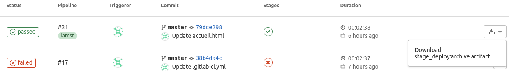

# AJC : Projet fondamental

## Description du projet

Mise en place d’une chaîne d’intégration continue avec AWS.
- Première phase :
Installation automatisé d’un environnment de Labs via Ansible.
  * Une VM Gitlab.
  * Une VM serveur Web (apache2).
  * Une VM en local type Linux. (virtualBox, WSL, GitBash, SSH).
  
- Seconde phase :
Mise en place via GitLab du CI (continious integration) pour la démonstration nous cherchons à deployer
de façon automatiser l’intégration de pages Web statiques. Le framework utilisé sera JEKYLL.
Nous aimerions un déclenchement de l’integration des pages web (Jekyll) sur la machine virtuelle serveur
web AWS.

## Description du repo

## Déroulement du projet

### Etape 1
La VM locale est déjà créée avec une distro Debian. Il faut donc installer Ansible :
 - `echo "deb http://ppa.launchpad.net/ansible/ansible/ubuntu trusty main" >> /etc/apt/sources.list` (déjà  en root donc pas besoin du `tee -a`)
 - `apt-key adv --keyserver keyserver.ubuntu.com --recv-keys 93C4A3FD7BB9C367`
 - `apt update`
 - `apt install ansible`

### Etape 2
Récupérer *access_key_id* et *secret_access_key* depuis AWS console pour pouvoir créer les deux VMs sur AWS en utilisant Ansible :
 - Sur la console AWS : **IAM &rarr; Users &rarr; Add user &rarr; Access type : Programmatic access &rarr; next &rarr; Attach existing policies directly &rarr; Filter: Policy type: AmazonEC2FullAccess &rarr; Create user &rarr; Download .csv**
 - Installer *boto* puis configurer le fichier *~/.boto* avec les données d'accès : 
    * `yes | apt install python-pip` 
    * `pip install boto`
    * Ajouter *access_key_id* et *secret_access_key* dans le fichier *~/.boto*
  * OU BIEN : utiliser des variables d'environnement à la place de *boto* :
    * `export AWS_ACCESS_KEY_ID=...` 
    * `export AWS_SECRET_ACCESS_KEY=...`

### Etape 3
Pour la création des deux VMs AWS on a besoin d'une clé privée pour pouvoir établir une connexion SSH avec les deux VMs par la suite. Je vais donc utiliser la clé que j'ai déjà créée pour d'autres VMs. Pour ce faire, il faut juste mettre la clé nommée *ec2_bassem.pem* dans un dossier *keys* à côté du fichier [VM_local_Debian/playbook.yml](./VM_local_Debian/playbook.yml) (`ansible-playbook playbook.yml`) qu'on va lancer par la suite pour créer les deux VMs AWS : GitLab et Apache2 en utilisant la commande `ansible-playbook playbook.yml`

### Etape 4
Une fois les deux VMs sont créées il faut modifier le fichier */etc/ansible/hosts* : 
* `echo "[gitlab_server]" >> /etc/ansible/hosts` 
* `echo "IP1 ansible_ssh_user=admin ansible_ssh_private_key_file=/root/projet_fondamental/keys/ec2_bassem.pem" >> /etc/ansible/hosts` . Il faut remplacer *IP1* par l'adresse IP public de la VM qui va être utilisée pour deployer GitLab.
* `echo "[web_server]" >> /etc/ansible/hosts`
* `echo "IP2 ansible_ssh_user=admin ansible_ssh_private_key_file=/root/projet_fondamental/keys/ec2_bassem.pem" >> /etc/ansible/hosts` . Il faut remplacer *IP2* par l'adresse IP public de la VM qui va être utilisée pour deployer Apache2.

### Etape 5

Dans cette étape on va configurer les deux VM : Gitlab et Apache2 en utilisant le fichier [playbook.yml](./VM_local_Debian/Configuration_vms/playbook.yml) via la commande `ansible-playbook -b playbook.yml` (pour ce faire il faut se mettre au niveau du dossier [Configuration_vms](./VM_local_Debian/Configuration_vms) dans le shell).

Le fichier playbook permet de :
* Installer Docker et créer un Docker container avec Apache2 dans la première VM
* Installer Docker dans la deuxième VM qui sera dédiée à Gitlab

### Etape 6

Dans la deuxième VM dédiée à Gitlab il faut déployer :

* Un docker container avec Gitlab
  
* Un docker container avec Gitlab-Runner

Pour ce faire j'ai utilisé **docker-compose** que j'ai installé au préalable dans la VM :

* `sudo curl -L "https://github.com/docker/compose/releases/download/1.29.1/docker-compose-$(uname -s)-$(uname -m)" -o /usr/local/bin/docker-compose`
  
* `sudo chmod +x /usr/local/bin/docker-compose`

Puis j'ai lancé la commande `docker-compose up -d` en utilisant le fichier [docker-compose.yml](./VM_Gitlab/docker-compose.yml).

Il faut attendre un peu le lancement de Gitlab. Une fois c'est fait il ne reste que d'**enregistrer** le *runner*. Mais avant de faire ça il faut d'abord se connecter à Gitlab via un navigateur web, créer un repository qu'on utilisera pour y mettre des pages html, et finalement récupérer le token.

Pour se connecter à Gitlab via le navigateur web il nous faut une connexion SSH avec un **port forwarding** : `ssh -i path/to/the/private/key -L 8080:80 admin@3.238.70.255`

**Remarque**:
Il faut d'abord configurer le security group de la VM Gitlab pour autoriser les connexion SSH sur le port 22. Pour moi ça était déjà fait.

Maintenant on peut récupérer le token en ouvrant Gitlab dans le navigateur web avec l'URL : **http://localhost:8080** (Avec ceci, ça va faire un port forwarding au **http://3.238.70.255:80** et vu que le docker container de Gitlab a été créé avec un port forwarding 80:80 donc la connexion s'est bien établie.)

Pour enregister le runner il faut établir une connexion SSH de la VM Gitlab et lancer la commande `gitlab-runner register` dans le container de gitlab-runner en utilisant la commande `docker exec -it gitlab-runner gitlab-runner register` (le premier *gitlab-runner* est le nom du container et le second est la commande).
Un TTY va se créer et on peut enregister le runner avec l'URL *http://3.238.70.255*, le token qu'on a récupéré, le *runner executor* (à savoir docker) et l'image qui sera utilisée par le runner executor (à savoir ruby:2.6).

### Etape 7

Finalement dans cette étape il ne reste plus que la partie intégration continue pour automatiser l'intégration des pages web (en utilisant le framework Jekyll) sur la VM serveur web Apache2.

Le docker container que va créer le runner pour intégrer les pages web, va devoir établir une connexion SSH pour transférer les fichiers au serveur web Apache2 (sachant que le container a été créé avec un port forwarding 22:22). Pour ce là il faut donner un mot de passe au user *admin* en utilisant la commande `passwd admin`.

Une fois c'est fait, il faut définir ce mot de passe comme une variable d'environnement appelée *"SSHPASS"* dans Gitlab.

Finalement, il faut créer un fichier [.gitlab-ci.yml](./VM_Gitlab/script_gitlab-ci.yml) qui va démarrer le CI. À noter que le répertoire qui sert d'entrepôt des pages web dans le docker container est le *"/usr/local/apache2/htdocs/"* et non pas *"/var/www/html"*.

### Test Réussi

On aboutit finalement à une chaîne d'intégration continue qui marche bien avec la possibilité de télécharger l'artifact généré (voir la photo ci-dessous)

